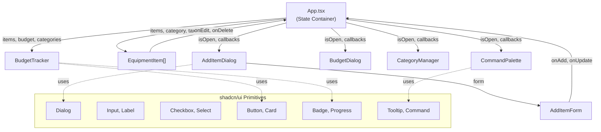
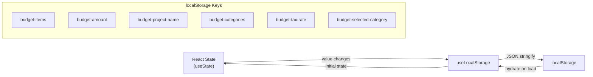

# Knowledge Base

> This is the unified, living documentation for traidcraft/cl-plugin-org-test-linear.
> It captures architecture, patterns, and learnings that evolve with the codebase.
> The top sections (Product through Project History) are populated by `/codelantern:discover`.
> The bottom sections (Quick Reference through Changelog) are populated by `/codelantern:consolidate`.

---

## Index

| Section | Description |
|---------|-------------|
| [Product](#product) | What the product does, who uses it, goals |
| [Architecture](#architecture) | System overview, components, data flow |
| [Tech Stack](#tech-stack) | Languages, frameworks, infrastructure |
| [Code Style](#code-style) | Actual code patterns discovered from the codebase |
| [Guidelines & Conventions](#guidelines--conventions) | Commit conventions, linter configs, communication style |
| [Project History](#project-history) | Key milestones, contributors, evolution |
| [Quick Reference](#quick-reference-dodont) | DO/DON'T patterns — read first |
| [MCP Servers](#mcp-servers) | Available AI tool servers and when to use them |
| [Common Tasks (Recipes)](#common-tasks-recipes) | Step-by-step guides for frequent operations |
| [Changelog](#changelog) | Document history |

---

## Product

**Budget Planner** is a React-based web application that helps users track and manage equipment purchases and project budgets in real time. Users can add items with prices and categories, define a total budget, track spending with automatic tax calculations (configurable tax rates), and receive visual feedback on budget status.

### Users

- **Project Managers/Planners** — managing equipment procurement with multi-category budgets (e.g., AV equipment, lighting, staging)
- **Production Teams** — film, event, or construction professionals needing quick equipment cost estimation
- **Equipment Coordinators** — tracking and organizing purchases by category against approved budgets
- **Power Users** — keyboard-centric workflows using command palette (Cmd+K), quick add (Cmd+D), and data import/export

### Features

| Feature | Component | Details |
|---------|-----------|---------|
| Item Management | `AddItemDialog`, `EquipmentItem` | Add, edit, delete items with name, price, category, taxable flag, optional link |
| Budget Tracking | `BudgetTracker` | Set budget, track remaining vs. overspend, visual progress bar |
| Category Management | `CategoryManager` | Create, delete, manage custom categories; filter items by category |
| Tax Calculation | `App.tsx` | Configurable tax rate (default 13%), applied per-item based on taxable flag |
| Command Palette | `CommandPalette` | Cmd+K search/command interface |
| Sorting | `App.tsx` | Multi-column sort (Name, Category, Price, Price+Tax); toggle ASC/DESC |
| Data Persistence | `useLocalStorage` hook | Client-side localStorage for all state |
| Export/Import | `App.tsx` | JSON file export/import for full budget state |
| Storybook | `*.stories.tsx` files | Visual component testing and documentation |

### Goals

- Fast, intuitive budget tracking without external spreadsheets
- Clear visual feedback on budget health (on-track vs. over budget)
- Collaborative workflows through data export/import
- E2E testing repository for validating CodeLantern agentic workflows with Linear integration

---

## Architecture

### System Overview

Budget Planner is a client-side React SPA with no backend. All state is managed via React hooks and persisted to browser localStorage. The app uses a props-drilling pattern with `App.tsx` as the central state container orchestrating 6 feature components.

### Component Diagram



### Directory Structure

| Directory | Purpose |
|-----------|---------|
| `src/main.tsx` | Vite entry point; mounts React app |
| `src/App.tsx` | Root component; all state, logic, and orchestration |
| `src/components/` | Feature components (BudgetTracker, EquipmentItem, etc.) |
| `src/components/ui/` | shadcn/ui primitives (Dialog, Button, Input, etc.) |
| `src/components/__mocks__/` | Storybook mock data |
| `src/hooks/` | Custom React hooks (`useLocalStorage`) |
| `src/lib/` | Utility functions (`cn()` for Tailwind class merging) |
| `index.html` | HTML shell with root div |

### Data Flow



**Calculation pipeline:** Items list → filter by category → filter included items → apply tax multiplier per item → sum total cost → compare to budget → render progress bar and category breakdown.

### Key Dependencies

| Dependency | Role |
|------------|------|
| `react@19.2` | UI framework |
| `radix-ui@1.4` | Unstyled accessible UI primitives |
| `tailwindcss@4.1` | Utility-first CSS |
| `cmdk@1.1` | Command palette framework |
| `lucide-react@0.563` | Icon library |
| `class-variance-authority@0.7` | Component variant system |

### Design Decisions

1. **No backend** — localStorage is the single source of truth. No multi-device sync, no auth, browser storage limits apply.
2. **Props drilling over Context/Redux** — App.tsx is the state hub. Simple and transparent for ~10 components.
3. **Per-item taxable flag** — Tax calculation is item-level, supporting mixed-tax scenarios common in equipment purchasing.
4. **Inline editing** — EquipmentItem handles both display and edit modes (click to edit, Enter/Escape) to avoid extra modals.
5. **Storybook as first-class artifact** — Every feature component has a parallel `.stories.tsx` file with centralized mock data.

---

## Tech Stack

### Languages & Frameworks

| Technology | Version | Purpose |
|------------|---------|---------|
| TypeScript | ~5.9.3 | Language (strict mode) |
| React | ^19.2.0 | UI framework |
| Vite | ^7.2.4 | Build tool and dev server |
| Tailwind CSS | ^4.1.18 | Utility-first CSS |
| Radix UI | ^1.4.3 | Accessible UI primitives |
| shadcn | ^3.8.4 | Component scaffolding (New York style) |
| Lucide React | ^0.563.0 | Icon library |
| cmdk | ^1.1.1 | Command palette |

### Testing

| Tool | Version | Purpose |
|------|---------|---------|
| Vitest | ^4.0.18 | Unit/component testing |
| Playwright | ^1.58.2 | E2E testing |
| Storybook | ^10.2.10 | Component documentation and visual testing |
| Chromatic | ^15.1.1 | Visual regression testing |
| @storybook/addon-a11y | ^10.2.10 | Accessibility testing |

### Code Quality

| Tool | Version | Configuration |
|------|---------|---------------|
| ESLint | ^9.39.1 | Flat config format (`eslint.config.js`) |
| TypeScript ESLint | ^8.46.4 | Strict type checking |
| eslint-plugin-react-hooks | ^7.0.1 | Hook rules |
| eslint-plugin-react-refresh | ^0.4.24 | Vite HMR |

### Infrastructure

- **Storage:** Browser localStorage (client-side only)
- **SCM:** GitHub (`traidcraft/cl-plugin-org-test-linear`)
- **PM:** Linear (team key: TRA)
- **CI/CD:** GitHub Actions (CodeLantern dispatch workflow)
- **Node.js:** v22 (in CI)

### NPM Scripts

```bash
npm run dev             # Vite dev server with HMR
npm run build           # TypeScript check + Vite production build
npm run lint            # ESLint
npm run storybook       # Storybook on port 6006
npm run build-storybook # Static Storybook build
npm run chromatic       # Visual regression tests
```

---

## Code Style

### Formatting

- **Indentation:** 2 spaces
- **Semicolons:** Always
- **Quotes:** Double quotes (`"react"`, `"text-sm"`)
- **Trailing commas:** Yes, in objects and arrays
- **Line length:** ~80-100 characters

### Naming Conventions

| Element | Convention | Examples |
|---------|-----------|----------|
| Components | PascalCase | `BudgetTracker`, `AddItemDialog` |
| Files (components) | PascalCase | `BudgetTracker.tsx`, `CommandPalette.tsx` |
| Files (utilities) | camelCase | `useLocalStorage.ts`, `data.ts` |
| Directories | lowercase | `components/`, `hooks/`, `lib/` |
| State variables | camelCase | `isEditingName`, `selectedCategory` |
| Event handlers | `handle` prefix | `handleSave`, `handleKeyDown` |
| Callback props | `on` prefix | `onEditBudget`, `onAddItem` |
| Types/Interfaces | PascalCase | `Item`, `BudgetTrackerProps` |
| Props interfaces | `Props` suffix | `AddItemFormProps`, `EquipmentItemProps` |
| Constants | SCREAMING_SNAKE | `CATEGORY_COLORS` |
| Custom hooks | `use` prefix | `useLocalStorage` |

### Import Organization

1. React / external libraries
2. Internal UI components (`@/components/ui/...`)
3. Local components / utilities (`@/...`)
4. Type imports (using `type` keyword)
5. Icons (`lucide-react`)

Path alias: `@/*` maps to `./src/*`

### Type Patterns

- `interface` for component props (extensible): `interface BudgetTrackerProps { ... }`
- `type` for unions/literals: `type SortColumn = "name" | "category" | "price" | "priceTax"`
- Generics for reusable hooks: `useLocalStorage<T>(key: string, defaultValue: T)`
- `React.ComponentProps<typeof Primitive>` for UI wrapper components

### Error Handling

- **Try/catch** for JSON parsing and localStorage access
- **Silent failure** for non-critical operations (localStorage errors return default value)
- **Input validation** with early returns: `if (!editedName.trim() || isNaN(price)) return`
- **User alerts** for import errors: `alert("Invalid JSON file...")`

### Component Patterns

- Functional components with hooks (no class components)
- Named exports: `export function BudgetTracker(...)` (default export only for `App`)
- Props destructured in function parameters
- `useCallback` for handlers passed as props
- `useMemo` for expensive computations (sorting)
- Custom hooks return tuples: `[value, setter]`
- `cn()` utility for conditional Tailwind class merging

---

## Guidelines & Conventions

### Linting

- ESLint v9 flat config format (`eslint.config.js`)
- Strict TypeScript: `noUnusedLocals`, `noUnusedParameters`, `noFallthroughCasesInSwitch`
- React hooks and refresh plugins enabled
- Storybook ESLint plugin for story files

### Commit Messages

- Format: `type: message` (lowercase, concise)
- Types observed: `docs:` for documentation changes
- Explain both "what" and "why"

### Branch Naming

- Feature branches: `*/issue-{N}` or `*-issue-{N}` (auto-detected by CI workflow)

### Storybook Conventions

- Story files: `{ComponentName}.stories.tsx` alongside component files
- Meta title format: `Features/{ComponentName}` or `Components/{Type}/{ComponentName}`
- Use `satisfies Meta<typeof Component>` for type safety
- Story names in PascalCase: `Default`, `AddMode`, `EditMode`, `OverBudget`
- Use `fn()` from `storybook/test` for callback mocks
- Include `tags: ["autodocs"]` for automatic documentation
- Mock data centralized in `__mocks__/data.ts`

### Documentation Style

- Clear, instructional tone
- Tables, headings, and structured formatting
- YAML workflow comments use ASCII separators (e.g., `# ─── Section ─────`)

---

## Project History

Project recently initialized (single commit) — history will be populated as the project evolves.

---

## Quick Reference (DO/DON'T)

### DO (Patterns to Follow)

<!-- Accumulated from PR consolidation -->

- Read this knowledge base before starting work on any issue
- Use the CodeLantern MCP (`mcp__cl__*`) for all issue and PR operations — never use `mcp__github__*`
- Use Context7 MCP for library documentation lookups
- Capture learnings in PR descriptions (Learnings section)
- Follow existing patterns — check this KB first
- Keep PRs focused — one issue per PR
- Write clear commit messages that explain "why"

### DON'T (Mistakes to Avoid)

<!-- Accumulated from PR consolidation -->

- Don't hardcode project/repository values — read from `.codelantern/config.json`
- Don't skip the planning phase for non-trivial features
- Don't merge without updating the knowledge base
- Don't introduce new patterns without documenting them here
- Don't leave the Learnings section empty in PRs

---

## MCP Servers

Model Context Protocol (MCP) servers provide AI agents with specialized tools.

| Server | Purpose | When to Use |
|--------|---------|-------------|
| **CodeLantern** (`mcp__cl__*`) | All issue, PR, and project board operations | Create PRs, manage issues, search code, labels, project operations |
| **Context7** | Library documentation | Need up-to-date docs for any library or framework |

### CodeLantern MCP

All issue, PR, and project board operations go through the CodeLantern MCP server. Always use `mcp__cl__*` tools — never fall back to `mcp__github__*` or other MCP tools for these operations.

**Common operations:**
- `mcp__cl__create_pull_request` / `mcp__cl__update_pull_request` — PR management
- `mcp__cl__search_issues` — Find issues with specific criteria
- `mcp__cl__create_issue` / `mcp__cl__update_issue` — Issue management
- `mcp__cl__create_labels` — Label management
- `mcp__cl__configure_project` — Project board setup

**Best for:** PR workflows, issue management, label operations, project board operations.

### Context7 MCP

Provides current, version-specific documentation and code examples.

**Usage pattern:**
```
# First resolve the library ID
mcp_context7_resolve-library-id(libraryName: "react", query: "useEffect cleanup")

# Then query documentation
mcp_context7_query-docs(libraryId: "/facebook/react", query: "useEffect cleanup examples")
```

**Best for:** API references, code patterns, configuration guides, troubleshooting.

---

## Common Tasks (Recipes)

### Starting Work on an Issue

1. Run `/codelantern:refresh` to understand current state (if resuming work)
2. If no active work, run `/codelantern:architect` to create a technical plan for the next Ready issue
3. Run `/codelantern:implement` to execute the plan
4. Fill in Learnings section before marking PR ready

### Adding a New Pattern

1. Document it in the relevant section of this KB
2. Add to "DO (Patterns to Follow)" if it's a best practice
3. If replacing an old pattern, update rather than add
4. Link to the source PR in the changelog

### Updating the Knowledge Base

After merging a PR:
1. Run `/codelantern:consolidate` from the feature branch
2. Review extracted learnings
3. Commit the KB updates

---

## Changelog

| Date | PR | Summary |
|------|-----|---------|
| 2026-03-30 | Initial | Project initialized with CodeLantern |
