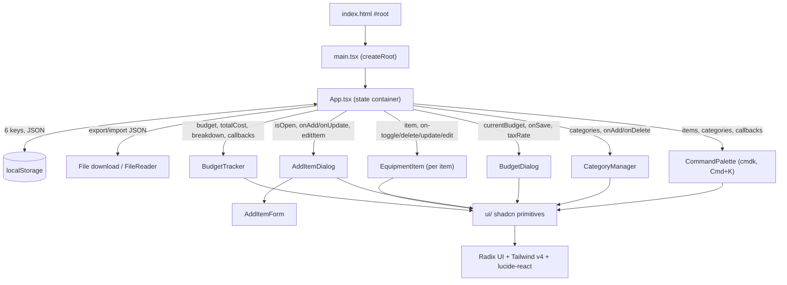

# Project Overview

## Product

**What it does** — A client-only single-page budget/purchase planner (browser title "Purchase Planner", package `budget-planner`). The user names a project, sets a budget and a tax rate, then adds line items (name, category, price, optional purchase link, taxable flag, included flag). It live-computes total cost (tax applied per taxable item), budget remaining/over, percent used, and a per-category cost breakdown. State persists to the browser and can be exported to / imported from a JSON file.

**Who the users are** — Individuals or small teams planning an equipment purchase against a fixed budget. The mock data is AV/studio gear (microphone, studio monitors, webcam, mechanical keyboard) across Audio/Video/Accessories/Peripherals categories, so the archetypal user is someone speccing a studio or home-office setup and deciding what fits the budget.

**Goals** — Decide which items to buy within a budget by toggling items in and out (the `included` flag) and instantly seeing whether the plan is under or over; understand where money goes via the category breakdown; keep the plan portable and offline through JSON export/import. There is no monetization or business model in the code.

**Current features** (all implemented) — Budget tracking with an under/over indicator and a progress bar (yellow past 80%, red when over); per-category spend breakdown bar with tooltips; inline-editable project name; configurable tax rate (default 13%) applied per taxable item; equipment items with add/edit/delete, an include/exclude checkbox (excluded items are struck through and dropped from totals), an optional external purchase link, and both inline-row and modal editing; category management (add/remove, deletion blocked while a category is in use) with filter badges; column sorting (name, category, price, price+tax); a `cmdk` command palette (⌘K) with fuzzy action search; keyboard shortcuts (⌘K palette, ⌘D add item); JSON export/import of full app state; responsive mobile/desktop layouts. `today.md` tracks not-yet-built ideas (per-item notes, priority indicator, select/deselect all, link-icon column, dark mode).

**Non-goals / success metrics** — Not documented.

## Architecture

**System overview** — A purely client-side React 19 + TypeScript + Vite SPA with no backend, no API layer, and no router. `index.html` mounts a single `#root` and loads `src/main.tsx`, which renders one root component `App` inside `StrictMode`. All application state lives in `App.tsx` and persists to browser `localStorage` via a custom `useLocalStorage` hook. Everything below `App` is a presentational feature component that receives data and callbacks through props — a classic lifted-state / prop-drilling pattern with no Context, Redux, Zustand, or server state.

**Major components** — `App.tsx` is the single stateful container. It wires: **BudgetTracker** (summary card: editable project name, budget vs. total, over/under indicator, progress bar, category breakdown, export/import/set-budget/add buttons); **EquipmentItem** (one row per item, inline edit + mobile/desktop layouts); **AddItemDialog** wrapping **AddItemForm** (modal add/edit); **BudgetDialog** (set budget amount and tax rate); **CategoryManager** (add/remove categories); and **CommandPalette** (`cmdk` ⌘K palette dispatching the same App-level callbacks). All feature components compose shadcn/ui primitives from `src/components/ui/`.

**Directory → purpose** — `src/` app source (entry, root, global styles); `src/components/` feature components + stories; `src/components/ui/` shadcn/ui primitives (Radix-based) + stories; `src/components/__mocks__/` shared Storybook fixtures (`data.ts`); `src/hooks/` state-persistence hook; `src/lib/` `utils.ts` (only `cn()`); `.storybook/` Storybook config.

**Key entry points** — `src/main.tsx` (`createRoot().render(<StrictMode><App/></StrictMode>)`); `index.html` (`#root` + module script); `src/App.tsx` (owns all state; defines and exports the `Item` interface used across components); `src/hooks/useLocalStorage.ts`; `vite.config.ts` (`@vitejs/plugin-react` + `@tailwindcss/vite`, `@` → `./src` alias).

**Data flow** — Unidirectional. Budget data lives in React state in `App.tsx`, persisted per-slice to `localStorage` through `useLocalStorage` (keys `budget-items`, `budget-amount`, `budget-project-name`, `budget-categories`, `budget-tax-rate`, `budget-selected-category`). User action → App callback (setters wrapped in `useCallback`) → state update → a `useEffect` writes JSON to `localStorage` → re-render pushes fresh props down. Derived values (`totalCost`, `categoryBreakdown`, `filteredItems`, `sortedItems`) are computed in `App` each render (sort memoized). Transient UI state (modal flags, `editingItemId`, sort column/direction) uses plain `useState` and is not persisted.

**External boundaries** — Browser `localStorage` is the sole persistence mechanism. JSON export (Blob download) and import (FileReader) are the only file boundary; both are fully in-browser. There is no backend, API, `fetch`/`axios`, or router. A global `keydown` listener in `App` handles ⌘K and ⌘D.

## Tech Stack

**Languages** — TypeScript `~5.9.3` in strict mode (`noUnusedLocals`, `noUnusedParameters`, bundler resolution; app targets ES2022). React `^19.2.0` / react-dom `^19.2.0`. ESM (`"type": "module"`).

**Frameworks & build** — Vite `^7.2.4` with `@vitejs/plugin-react`; `@` alias → `./src`. Tailwind CSS v4 (`^4.1.18`) via `@tailwindcss/vite` — CSS-first config in `src/index.css`, no `tailwind.config` file. Supporting styling: `tw-animate-css`, `tailwind-merge`, `clsx`, `class-variance-authority`.

**UI** — shadcn/ui (`components.json`, style "new-york", base color neutral) with generated primitives in `src/components/ui/`; Radix primitives via the unified `radix-ui ^1.4.3` package; `cmdk ^1.1.1` command palette; `lucide-react ^0.563.0` icons.

**Storage** — No database or server. All persistence is browser `localStorage` via `src/hooks/useLocalStorage.ts` (six `budget-*` keys); portability via JSON export/import. `src/components/__mocks__/data.ts` holds mock data used only by Storybook.

**Testing** — No unit/integration test files exist (no `*.test.*`/`*.spec.*`, no `test` script, no `vitest.config`). Test tooling is present but wired only through Storybook: `vitest ^4.0.18`, `@vitest/browser-playwright`, `@vitest/coverage-v8`, `playwright ^1.58.2`, and `@storybook/addon-vitest` — the intended path is Storybook component tests in a Playwright browser, not yet bound by config. Storybook `^10.2.10` on `@storybook/react-vite` (addons: docs, a11y, themes, vitest, onboarding, chromatic); every component has a co-located `.stories.tsx`.

**Commands** — `npm run dev`, `npm run build` (`tsc -b && vite build`), `npm run lint` (`eslint .`), `npm run preview`, `npm run storybook` (port 6006), `npm run build-storybook`, `npm run chromatic`, and `npm run lantern` (VitePress docs in `.codelantern/docs`).

**Hosting / CI** — No app deploy config (no vercel/netlify/Docker). The only workflow is `.github/workflows/cl-kb-sync.yml` ("CodeLantern KB Sync"), which on pushes to `main` touching `.codelantern/knowledge-base/**` mirrors those markdown files to the CodeLantern platform via GitHub OIDC (no stored secret). It is a docs/KB mirror, not app CI/CD.

**External services** — Chromatic (`chromatic ^15.1.1`, `@chromatic-com/storybook`) for Storybook visual regression; CodeLantern platform for KB sync. No analytics or runtime external APIs.

**Auth & data protection** — None. No login, accounts, or server; data is entirely client-side in `localStorage`. The only egress is the user-initiated JSON download and the docs-only KB sync.

**Performance targets** — Not documented (`App.tsx` uses `useMemo`/`useCallback`, but no stated targets).
